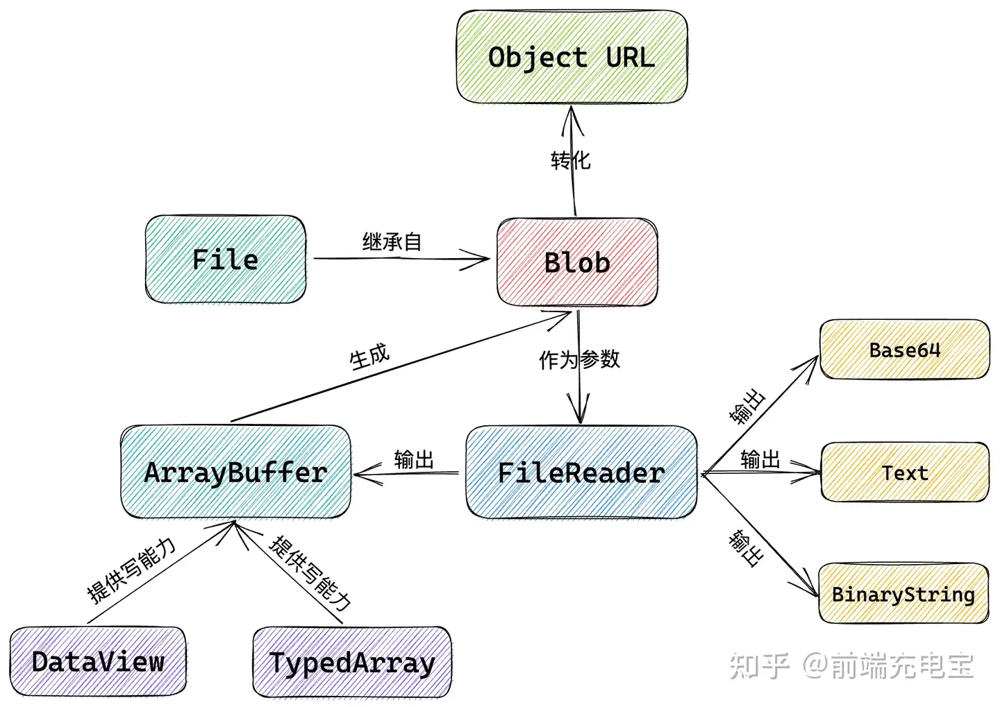

# 文件操作

- aaa



## 文件分割

::: demo  

```vue
<template>
    <div >
        <h3>文件分割器</h3>
        选择文件&nbsp;&nbsp;<input ref="fileInput" type="file" id="file-input" @change="handleSelectFile"><br>
        分割大小&nbsp;&nbsp;<input v-model="BLOCK_SIZE" type="number" placeholder="块大小(MB)">(MB)<br>
        文件类型&nbsp;&nbsp;<input v-model="extension" type="text" placeholder="文件类型">
        <br>
        <br>
        <button @click="downloadFiles">下载分割文件</button>
        <span>上传 .bin 类型的文件会失败</span>
    </div>
</template>

<script>
export default {
    data(){
        return {
            BLOCK_SIZE : 90 , // 90MB
            fileName:"",
            extension:""
        }
    },
    methods:{
        handleSelectFile(){
            const file = this.$refs["fileInput"].files[0];
            this.fileName = file.name;
            this.extension = (file.name+"").split(".").pop();
        },
        downloadFiles() {
            if(this.$refs["fileInput"].files.length==0){
                alert("请选择文件")
                return;
            }
            const file = this.$refs["fileInput"].files[0];
            if (!file) return;

            const chunkSize = this.BLOCK_SIZE * 1024 * 1024;
            const chunks = this.splitFile(file, chunkSize);
            this.downloadChunks(chunks);
        },
        splitFile(file, chunkSize) {
            const chunks = [];
            let start = 0;
            while (start < file.size) {
                const chunk = file.slice(start, start + chunkSize);
                chunks.push(chunk);
                start += chunkSize;
            }
            return chunks;
        },
        downloadChunks(chunks) {
            chunks.forEach((chunk, index) => {
                const url = URL.createObjectURL(chunk);
                const a = document.createElement('a');
                a.href = url;
                a.download = `${this.fileName}.part_${index}.`+this.extension;
                document.body.appendChild(a);
                a.click();
                document.body.removeChild(a);
                URL.revokeObjectURL(url);
            });
        }
    }
}

</script>
```

:::

## 文件合并

::: demo

```vue
<template>
<div >
    <h3>文件合并器</h3>
    <input ref="inputFile" type="file" id="file-input" multiple>
    <button @click="handleDownload">合并文件并下载</button>
</div>
</template>

<script>
export default {
  data(){
    return {
        fileName: "",
        extension: ""
    }
  },
  methods: {
    handleSelectFile() {
        const file = this.$refs["fileInput"].files[0];
        this.fileName = file.name;
        this.extension = (file.name + "").split(".").pop();
    },
    mergeFiles(files) {
        // 读取每个文件为ArrayBuffer  
        const filePromises = files.map(file => new Promise((resolve, reject) => {
            const reader = new FileReader();
            reader.onload = event => resolve(event.target.result);
            reader.onerror = error => reject(error);
            reader.readAsArrayBuffer(file);
        }));

        // 等待所有文件读取完成  
        return Promise.all(filePromises).then(arrayBuffers => {
            // 将所有ArrayBuffer合并为一个  
            const totalLength = arrayBuffers.reduce((acc, buf) => acc + buf.byteLength, 0);
            const resultBuffer = new Uint8Array(totalLength);
            let offset = 0;
            arrayBuffers.forEach(buf => {
                resultBuffer.set(new Uint8Array(buf), offset);
                offset += buf.byteLength;
            });

            // 创建Blob对象  
            const mergedBlob = new Blob([resultBuffer], { type: 'application/octet-stream' });
            return mergedBlob;
        });
    },
    downloadMergedFile(mergedBlob) {
        const url = URL.createObjectURL(mergedBlob);
        const a = document.createElement('a');
        a.href = url;
        a.download = this.fileName; // 假设合并后的文件为二进制格式  
        document.body.appendChild(a);
        a.click();
        document.body.removeChild(a);
        URL.revokeObjectURL(url);
    },

    async downloadMergedFile2(buffer) {
        const options = {
            suggestedName: this.fileName, // 建议的文件名  
            types: [
                {
                    description: '文件描述', // 文件的描述  
                    // accept: {
                    //     'text/plain': ['.txt'], // MIME 类型和对应的文件扩展名  
                    // },
                },
                // 可以添加更多类型  
            ],
            excludeAcceptAllOption: false, // 是否排除“接受所有文件”选项  
        };

        try {
            const fileHandle = await showSaveFilePicker(options);
            const writable = await fileHandle.createWritable();
            await writable.write(buffer)
            await writable.close()
        } catch (error) {
            console.error("保存文件失败", error);
            downloadMergedFile(buffer);
        }
    },
    handleDownload() {
        //文件是否为空
        if (this.$refs["inputFile"].files.length === 0) { alert('请选择要合并的文件'); return; }
        let files = [];
        // FileList转Array
        for (let i = 0; i < this.$refs["inputFile"].files.length; i++) {
            files.push(this.$refs["inputFile"].files[i]);
        };
        // 按名称排序
        files.sort((a, b) => a.name.localeCompare(b.name));

        // 获取文件名称 fileName.apk.part_index.bin  ==> fileName.apk
        let t = files[0].name.split(".");
        console.log(t);
        t.pop();
        console.log(t);
        t.pop();
        console.log(t);
        let name = t.join(".");
        this.fileName = name;
        console.log(this.fileName);

        //合并文件
        this.mergeFiles(files).then(mergedBlob => {
            this.downloadMergedFile2(mergedBlob);
        }).catch(error => {
            console.error('合并文件时发生错误:', error);
            alert('合并文件时发生错误，请检查文件是否正确选择');
        });
    }
  }
}

</script>
```

:::
