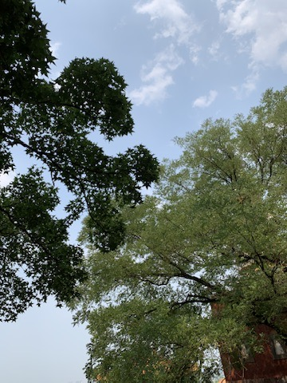

# 图片剪裁

::: demo

```html
<style>
.img-size .handle {
  padding: 10px 0;
}
.clip-image {
  width: 100%;
  display: flex;
}
.clip-image .origin {
  position: relative;
}
.clip-image .origin .box {
  position: absolute;
  left: -1px;
  top: -1px;
  width: 100%;
  height: 100%;
  border: 1px solid red;
}
.clip-image .origin,
.after {
  flex: 1;
}
.clip-image .origin .img {
  max-width: 100%;
  max-height: 100%;
}
button {
  font-size: 24px;
}
input {
  font-size: 24px;
  margin-left: 20px;
}
input[multiple="multiple"]{
  max-width:200px;
}
</style>
  <div class="handle">
    <input
      multiple="multiple"
      type="file"
      name=""
      id="files"
      onchange="imageUp()"
    />
    <button onclick="imageSize(0)">小一寸</button>
    <button onclick="imageSize(1)">一寸</button>
    <button onclick="imageSize(2)">大一寸</button>
    <button onclick="imageSize(3)">小二寸</button>
    <button onclick="imageSize(4)">二寸</button>
    <button onclick="imageSize(5)">大二寸</button>
    <button onclick="imageDown()">下载图片</button>
  </div>
  <div class="clip-image">
    <div class="origin">
      
      <div class="box"></div>
    </div>
    <div class="after">
      
    </div>
  </div>
  <div class="down"></div>
</div>
<script>
  let size = [
    {
      height: "378",
      width: "260",
      height2: "32",
      width2: "22",
    },
     {
      height: "413",
      width: "295",
      height2: "35",
      width2: "25",
    },
     {
      height: "567",
      width: "390",
      height2: "48",
      width2: "33",
    },
     {
      height: "531",
      width: "413",
      height2: "45",
      width2: "35",
    },
     {
      height: "579",
      width: "413",
      height2: "49",
      width2: "35",
    },
     {
      height: "626",
      width: "413",
      height2: "53",
      width2: "35",
    },
  ]
  let ratio= 4/window.devicePixelRatio
  let sizeIndex = 0
  function imageSize(index) {
    sizeIndex = index
    clipImage()
  }
  let first = true
  let type = "image/jpeg"
  function clipImage() {
    var image = document.getElementById("sourceImage")
    const canvas = document.createElement("canvas")
    var ctx = canvas.getContext("2d")
    let {width2,height2} = size[sizeIndex]
    canvas.width = width2*ratio
    canvas.height = height2*ratio
    // 在canvas上绘制图片
    if(image.naturalWidth/image.naturalHeight>width2/height2){
      ctx.drawImage(image, 0, 0,image.naturalWidth/image.naturalHeight*height2*ratio,height2*ratio)
      }else{
      ctx.drawImage(image, 0, 0,width2*ratio,image.naturalHeight/image.naturalWidth/width2*ratio)
    }
    // 将剪裁后的图片转换为DataURL
    var clippedImageDataURL = canvas.toDataURL(type)
    // 可以将剪裁后的图片显示在页面上或者下载
   document.getElementById("targetImage").src = clippedImageDataURL
  }
  function imageDown() {
    const fileUrl = document.getElementById("targetImage").src // 文件的URL地址
    const link = document.createElement("a")
    link.href = fileUrl
    link.setAttribute(
      "download",
      '图片' + "."+type.split('/')[1]
    )
    link.click()
  }
  // 在图片加载完成后剪裁图片
  document.getElementById("sourceImage").onload = clipImage
  function imageUp(e) {
    var e = window.event || e // change事件获取到的数据
    if (e.target.files[0].size > 500 * 1024 * 1024) {
      // 限制文件上传大小
      alert.error("上传单个文件大小不能超过 500M!")
    } else {
      type = e.target.files[0].type
      document.getElementById("sourceImage").file = e.target.files[0] // 文件赋值
      var reader = new FileReader()
      reader.onload = (function (aImg) {
        return function (e) {
          aImg.src = e.target.result
        }
      })(document.getElementById("sourceImage"))
      reader.readAsDataURL(e.target.files[0])
    }
    first = true
    clipImage()
    first = false
  }
</script>
```

:::
