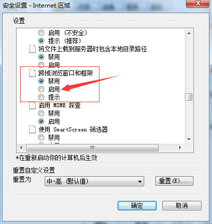
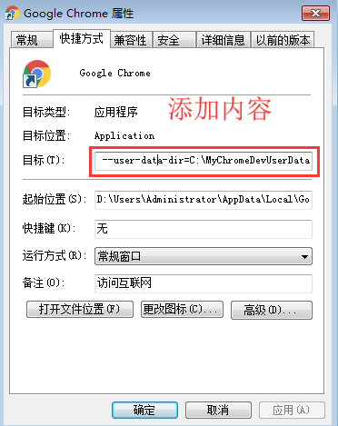
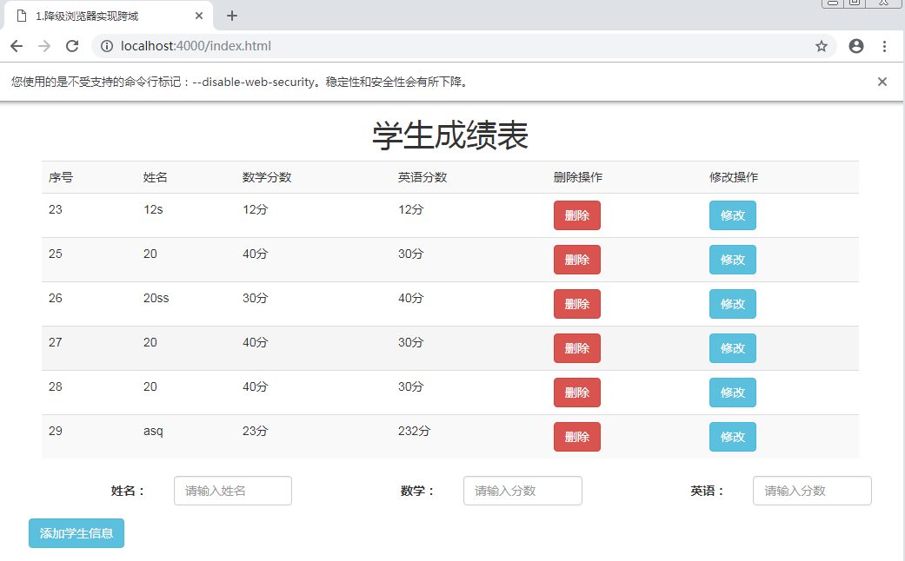

# 一.browser

## 1.学生成绩表案例

- 前端页面：<a href="/web-html/crossdomain/browser/">点击查看</a>
- 后端部分

  - 数据库：<a href="/web-mysql/base/practice/3.gitlab.html">这里以 mysql 为例，启动 mysql,使用 node 编写查询语句</a>
  - 后端接口：<a href="/web-node/base/oop/2.constructor.html">这里以 node 为例，启动后端</a>

  <h4 style="color:red">可以看到本地启动后端后，相同的接口在 postman 中调用没有问题，但是在前端页面中操作页面控制台提示报错</h4>

  

## 2.降级浏览器

原理：将浏览器的安全拦截功能撤掉，可以实现跨域访问数据

非常适合前端开发时使用，尤其是上线后前后端不存在跨域，只是开发时存在跨域

### 2.1 ie 浏览器：

1.安全设置中将跨域浏览窗口和框架选择启用

### 2.2 火狐浏览器：

1.地址栏中输入 about:config,然后单击“我了解此风险”

2.找到 security.fileuri.strict_origin_policy,然后在值下面的 true 右键单击，选择切换，修改其参数：true 改为 false

### 2.3 谷歌浏览器：

**方法一：红框处加 --allow-file-access-from-files**

**方法二（新版谷歌浏览器）**

- --user- data- dir=C:\MyChromeDevUserData

- c 盘中建立文件夹：MyChromeDevUserData

* 然后先点击“应用按钮”，再点击“确定按钮”，重启谷歌浏览器！

**降级成功**

<h4 style="color:red">浏览器降级后访问能正常使用</h4>

并非真的实现了跨域，只是把浏览器的拦截给撤掉了

## 3.应用场景
